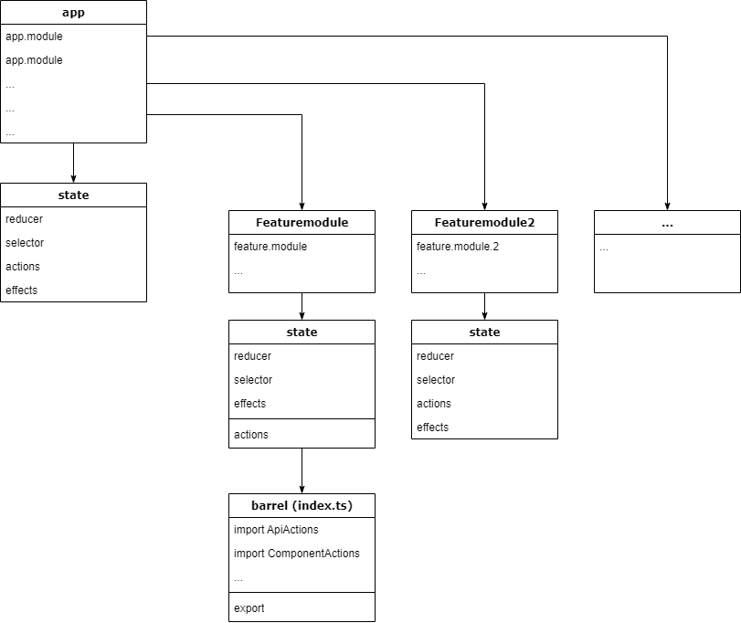

# Table

This project was generated with [Angular CLI](https://github.com/angular/angular-cli) version 15.0.4.

## Startup

Run `npm install` to install all dependencies.

## Development server

Run `ng serve` for a dev server. Navigate to `http://localhost:4200/`. The application will automatically reload if you change any of the source files.

## Debug Tools

Use `Redux Dev Tools` from eg. Google Chrome Addon Store to debug ngrx

# Structure

## Folder Structure

## NGRX Structure

